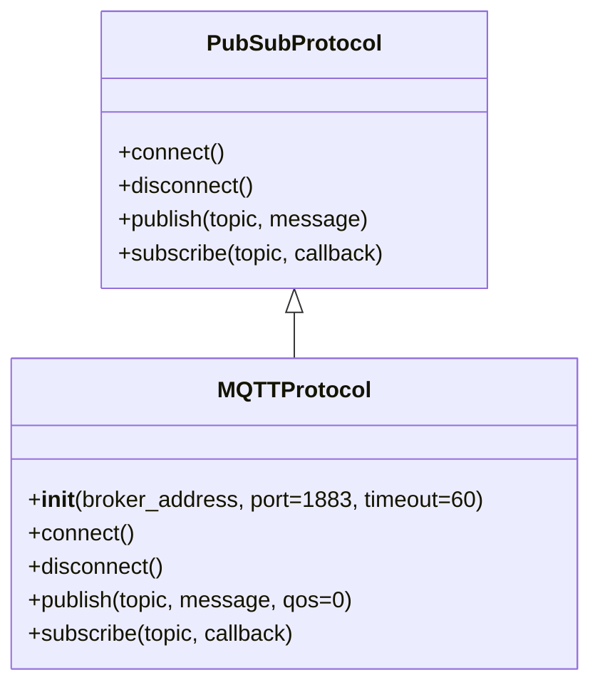
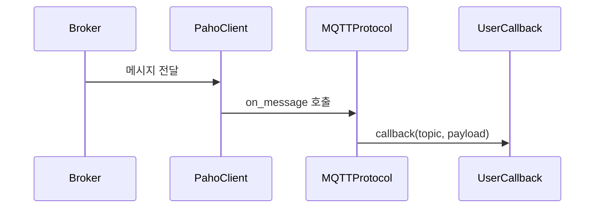

# MQTTProtocol – 사용 설명서

## 1. 문서 목적
이 문서는 EQ-1 Network 모듈에서 제공하는 `MQTTProtocol` 클래스의 구조, 사용 방법, 예외 처리 방식을 설명합니다.

## 2. 개요
`MQTTProtocol`은 Paho-MQTT 라이브러리를 기반으로 Pub/Sub 패턴의 통신을 지원하는 구현체입니다.

### 2.1 비동기 백그라운드 동작
- `connect()` 메서드를 호출하면, 내부적으로 별도의 스레드가 생성되어 MQTT 네트워크 통신을 처리합니다. 따라서 `connect()`는 블로킹(blocking)되지 않으며, 메인 프로그램은 다른 작업을 계속 수행할 수 있습니다.

### 2.2 주요 기능
- 브로커 연결 및 해제
- 토픽 구독 및 메시지 콜백
- 토픽 발행 (QoS 지원)
- 에러/이벤트 처리

## 3. 클래스 다이어그램 구조


## 4. 초기화
```python
from communicator.protocols.mqtt.mqtt_protocol import MQTTProtocol

mqtt = MQTTProtocol(
    broker_address="broker.example.com",
    port=1883,
    timeout=60
)
```

### 4.1 파라미터 설명
- broker_address: 브로커 주소 (IP 또는 호스트명)
- port: MQTT 포트 (기본 1883)
- timeout: 연결 타임아웃(초 단위)

## 5. 사용 예제
### 5.1 연결 및 구독
```python
def on_message(topic, payload):
    print(f"[{topic}] {payload}")

mqtt.connect()
mqtt.subscribe("vision/events", callback=on_message)
```

### 5.2 발행
```python
mqtt.publish("vision/events", "Camera started", qos=1)
```

### 5.3 연결 해제
```python
mqtt.disconnect()
```

## 6. 콜백 동작 흐름

### 6.1 콜백 시그니처
```python
def callback(topic: str, payload: bytes):
    ...
```

## 7. 예외 처리
### 7.1 주요 예외 클래스:
- ProtocolConnectionError: 브로커 연결 실패
- ProtocolError: 기타 통신 오류

### 7.2 예외 처리 예시:
```python
try:
    mqtt.connect()
except ProtocolConnectionError as e:
    print(f"Connection failed: {e}")
except ProtocolError as e:
    print(f"Protocol error: {e}")
```

## 8. 테스트 방법
- 단위 테스트
    - `pytest` 기반으로 mock 브로커를 활용
    - MQTT 브로커를 실제 실행해 통합 테스트 가능

## 9. 향후 확장 계획
- 보안
    - 인증서 기반 TLS/mTLS 지원
    - 자동 재연결 옵션
    - QoS 설정

## 10. 참고
- 상위 PRD: [PRD.md](PRD.md)
- README: [README.md](README.md)