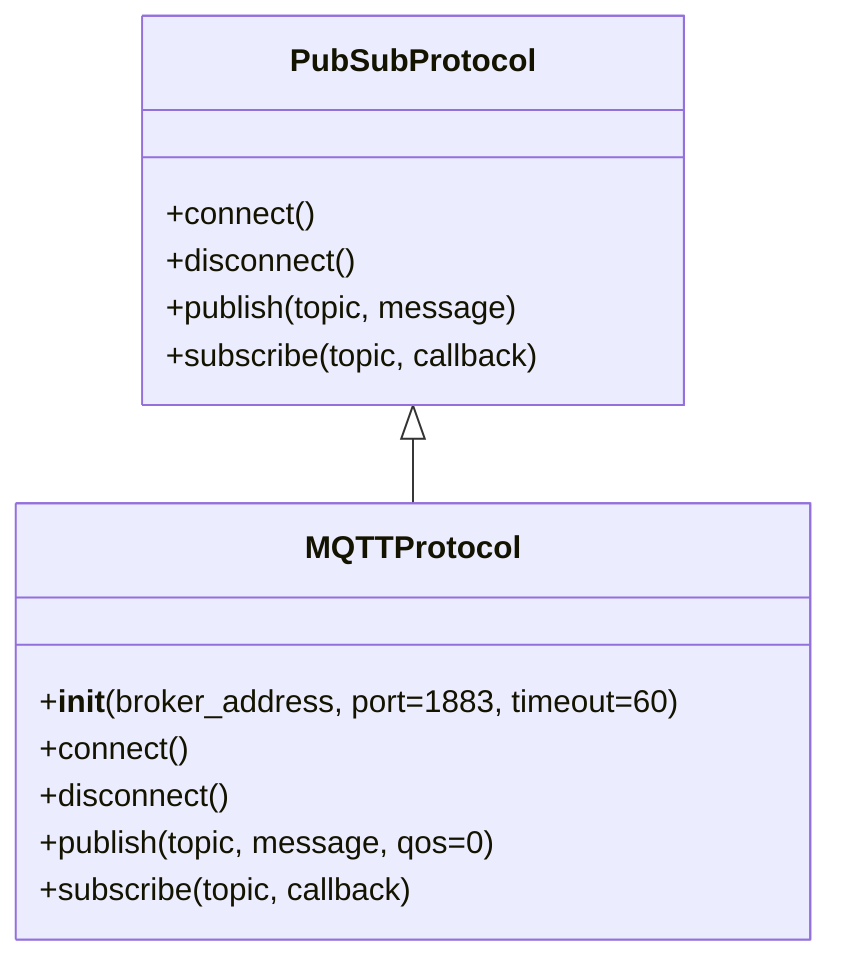

# MQTTProtocol 사용 가이드
MQTTProtocol은 EQ-1 Network의 Pub/Sub 프로토콜 구현체입니다.
MQTT 브로커와 연결하여 메시지 발행(publish), 토픽 구독(subscribe), 자동 재연결 및 데이터 유실 방지를 제공합니다.

## 1. 빠른 시작
```python
from communicator.protocols.mqtt.mqtt_protocol import MQTTProtocol

# 1. 프로토콜 객체 생성
mqtt = MQTTProtocol(
    broker_address="broker.example.com",
    port=1883,
    timeout=60
)

# 2. 브로커 연결
mqtt.connect()

# 3. 토픽 구독
mqtt.subscribe("topic/test", callback=print)

# 4. 메시지 발행
mqtt.publish("topic/test", "hello")

# 5. 연결 해제
mqtt.disconnect()
```

## 2. 주요 개념
### 동작 모드
- non-blocking (기본)
    - `loop_start()` 기반
    - 연결 후 별도 스레드에서 통신
    - 메인 스레드에서 자유롭게 작업 가능
- blocking
    - `loop_forever()` 기반
    - 별도 스레드 대신 메인 스레드에서 통신 루프
    - `stop_loop()`로 안전하게 종료 가능

### 주요 기능
- 브로커 연결/해제
- 토픽 구독 및 메시지 콜백 처리
- QoS 지원 메시지 발행
- 자동 재연결 및 구독 복구
- publish 큐잉 (연결이 끊겼을 때 메시지 보관 후 재전송)
- thread-safe API (publish, subscribe, unsubscribe)

## 3. 클래스 다이어그램 구조


### 초기화
```python
from communicator.protocols.mqtt.mqtt_protocol import MQTTProtocol

mqtt = MQTTProtocol(
    broker_address="broker.example.com",
    port=1883,
    timeout=60
)
```

### 파라미터 설명
- broker_address: 브로커 주소 (IP 또는 호스트명)
- port: MQTT 포트 (기본 1883)
- timeout: 연결 타임아웃(초 단위)

## 4. 고급 동작 방식
### 자동 재연결 및 데이터 유실 방지
- 연결 끊김 감지 → 자동 재연결 시도
- 재연결 성공 → 기존 구독 정보 복구
- 발행 실패 시 → 내부 큐에 보관 후 재전송

### thread-safe 처리
- Lock과 Queue를 활용하여 publish/subscribe가 안전하게 동작합니다.

### 콜백 흐름


## 5. 사용 방법
### 연결 및 구독
```python
def on_message(topic, payload):
    print(f"[{topic}] {payload}")

mqtt.connect()
mqtt.subscribe("vision/events", callback=on_message)
```

### 메시지 발행
```python
mqtt.publish("vision/events", "Camera started", qos=1)
```

### 연결 해제
```python
mqtt.disconnect()
```

### 예외 처리
#### 주요 예외 클래스:
- ProtocolConnectionError: 브로커 연결 실패
- ProtocolError: 기타 통신 오류

#### 예외 처리 예시:
```python
try:
    mqtt.connect()
except ProtocolConnectionError as e:
    print(f"Connection failed: {e}")
except ProtocolError as e:
    print(f"Protocol error: {e}")
```

## 6. 테스트 방법
- 단위 테스트
    - `pytest` 기반으로 mock 브로커를 활용
    - MQTT 브로커를 실제 실행해 통합 테스트 가능

## 7. 향후 확장 계획
- 보안
    - 자동 재연결 옵션
    - QoS 설정

## 8. 참고 자료
- [PRD.md](PRD.md)
- [README.md](README.md)