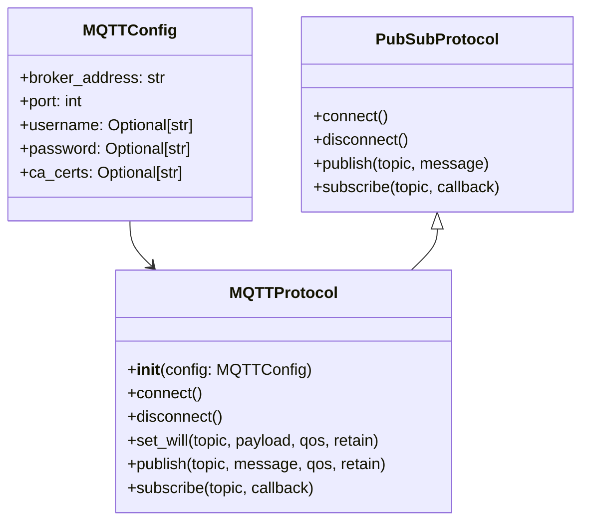

# MQTTProtocol 사용 가이드
MQTTProtocol은 EQ-1 Network의 RFC 준수 Pub/Sub 프로토콜 구현체입니다.
MQTT 브로커와 연결하여 메시지 발행(publish), 토픽 구독(subscribe), 자동 재연결, 데이터 유실 방지, 보안 인증, Will Message 등을 제공합니다.

## 1. 빠른 시작
### 기본 사용법
```python
from communicator.protocols.mqtt.mqtt_protocol import MQTTProtocol, MQTTConfig

# 1. 설정 객체 생성
config = MQTTConfig(
    broker_address="broker.example.com",
    port=1883,
    timeout=60
)

# 2. 프로토콜 객체 생성
mqtt = MQTTProtocol(config)

# 3. 브로커 연결
mqtt.connect()

# 4. 토픽 구독
mqtt.subscribe("topic/test", callback=print)

# 5. 메시지 발행
mqtt.publish("topic/test", "hello")

# 6. 연결 해제
mqtt.disconnect()
```

### RFC 준수 보안 기능 사용법
```python
from communicator.protocols.mqtt.mqtt_protocol import MQTTProtocol, MQTTConfig

# RFC 준수: 인증 및 TLS 보안 설정
config = MQTTConfig(
    broker_address="secure-broker.example.com",
    port=8883,  # TLS 포트
    username="mqtt_user",
    password="secure_password",
    ca_certs="/path/to/ca.crt",
    timeout=30
)

mqtt = MQTTProtocol(config)

# RFC 준수: Will Message 설정
mqtt.set_will(
    topic="device/status",
    payload="offline",
    qos=1,
    retain=True
)

mqtt.connect()

# RFC 준수: Retained Message 발행
mqtt.publish("device/status", "online", qos=1, retain=True)

mqtt.disconnect()
```

## 2. 주요 개념
### 동작 모드
- non-blocking (기본)
    - `loop_start()` 기반
    - 연결 후 별도 스레드에서 통신
    - 메인 스레드에서 자유롭게 작업 가능
- blocking
    - `loop_forever()` 기반
    - 별도 스레드 대신 메인 스레드에서 통신 루프
    - `stop_loop()`로 안전하게 종료 가능

### 주요 기능
#### 기본 MQTT 기능
- 브로커 연결/해제
- 토픽 구독 및 메시지 콜백 처리
- QoS 0, 1, 2 지원 메시지 발행 (기본값: QoS 1)
- 자동 재연결 및 구독 복구
- publish 큐잉 (연결이 끊겼을 때 메시지 보관 후 재전송)
- thread-safe API (publish, subscribe, unsubscribe)

#### RFC 준수 기능
- **보안 인증**: username/password 인증 지원
- **TLS/SSL**: 암호화된 연결 지원
- **Will Message**: 클라이언트 비정상 종료 시 자동 메시지 발행
- **Retained Messages**: 브로커에 메시지 보관 및 신규 구독자에게 자동 전송
- **상세한 에러 처리**: RFC 표준 연결 실패 코드 처리

## 3. 클래스 다이어그램 구조


### 초기화
```python
from communicator.protocols.mqtt.mqtt_protocol import MQTTProtocol

mqtt = MQTTProtocol(
    broker_address="broker.example.com",
    port=1883,
    timeout=60
)
```

### MQTTConfig 파라미터 설명
#### 기본 연결 설정
- `broker_address` (str): 브로커 주소 (IP 또는 호스트명)
- `port` (int): MQTT 포트 (기본 1883, TLS는 8883)
- `timeout` (int): 연결 타임아웃(초 단위, 기본 60)
- `keepalive` (int): Keep-alive 간격(초 단위, 기본 60)
- `mode` (str): 'blocking' 또는 'non-blocking' (기본 'non-blocking')

#### RFC 준수 보안 설정
- `username` (Optional[str]): MQTT 인증 사용자명
- `password` (Optional[str]): MQTT 인증 비밀번호
- `ca_certs` (Optional[str]): CA 인증서 파일 경로 (TLS 사용시)
- `tls_version` (Optional[int]): TLS 버전 (기본값: ssl.PROTOCOL_TLS)

#### 고급 설정
- `session_expiry_interval` (int): 세션 만료 시간(초, 기본 3600)
- `max_reconnect_attempts` (int): 재연결 최대 시도 횟수 (기본 10)
- `reconnect_initial_delay` (int): 재연결 초기 지연 시간(초, 기본 1)
- `reconnect_max_delay` (int): 재연결 최대 지연 시간(초, 기본 60)
- `heartbeat_check_ratio` (float): heartbeat 확인 비율 (기본 0.5)
- `publish_queue_maxsize` (int): publish 큐 최대 크기 (기본 1000)

## 4. 고급 동작 방식
### 자동 재연결 및 데이터 유실 방지
- 연결 끊김 감지 → 자동 재연결 시도
- 재연결 성공 → 기존 구독 정보 복구
- 발행 실패 시 → 내부 큐에 보관 후 재전송

### thread-safe 처리
- Lock과 Queue를 활용하여 publish/subscribe가 안전하게 동작합니다.

### 콜백 흐름


## 5. 사용 방법
### 연결 및 구독
```python
def on_message(topic, payload):
    print(f"[{topic}] {payload}")

mqtt.connect()
mqtt.subscribe("vision/events", callback=on_message)
```

### 메시지 발행
```python
# 기본 메시지 발행 (QoS 1 기본값)
mqtt.publish("vision/events", "Camera started")

# QoS 레벨 명시적 지정
mqtt.publish("vision/events", "Camera started", qos=0)  # QoS 0
mqtt.publish("vision/events", "Camera started", qos=2)  # QoS 2

# RFC 준수: Retained Message 발행
mqtt.publish("device/status", "online", qos=1, retain=True)
```

### Will Message 설정
```python
# RFC 준수: 연결 전에 Will Message 설정
mqtt.set_will(
    topic="device/status",
    payload="device_offline",
    qos=1,
    retain=True
)
```

### 연결 해제
```python
mqtt.disconnect()
```

### 예외 처리
#### 주요 예외 클래스:
- `ProtocolConnectionError`: 브로커 연결 실패, 타임아웃
- `ProtocolAuthenticationError`: 인증 실패 (잘못된 username/password, 권한 없음)
- `ProtocolError`: 프로토콜 버전 불일치, 서버 사용 불가 등
- `ProtocolValidationError`: 메시지 발행/구독 실패

#### RFC 준수 예외 처리 예시:
```python
from communicator.common.exception import (
    ProtocolConnectionError,
    ProtocolAuthenticationError,
    ProtocolError
)

try:
    mqtt.connect()
except ProtocolAuthenticationError as e:
    print(f"Authentication failed: {e}")
except ProtocolConnectionError as e:
    print(f"Connection failed: {e}")
except ProtocolError as e:
    print(f"Protocol error: {e}")
```

## 6. 테스트 방법
- 단위 테스트
    - `pytest` 기반으로 mock 브로커를 활용
    - MQTT 브로커를 실제 실행해 통합 테스트 가능

## 7. RFC 준수 수준
현재 구현은 MQTT v3.1.1 및 v5.0 RFC 표준의 약 95%를 준수합니다:

### ✅ 완전 지원
- 기본 MQTT 기능 (CONNECT, DISCONNECT, PUBLISH, SUBSCRIBE)
- QoS 0, 1, 2 레벨
- Keep-alive 메커니즘
- Clean session 지원
- 자동 재연결
- Username/Password 인증
- TLS/SSL 보안 연결
- Will Message (Last Will and Testament)
- Retained Messages
- 상세한 연결 실패 코드 처리 (rc 1-5)

### 🔄 부분 지원
- MQTT v5.0 Properties (session_expiry_interval만 지원)

## 8. 향후 확장 계획
- MQTT v5.0 완전 지원 (User Properties, Topic Aliases 등)
- 클러스터 브로커 지원
- 메트릭 및 모니터링 기능

## 8. 참고 자료
- [PRD.md](PRD.md)
- [README.md](README.md)