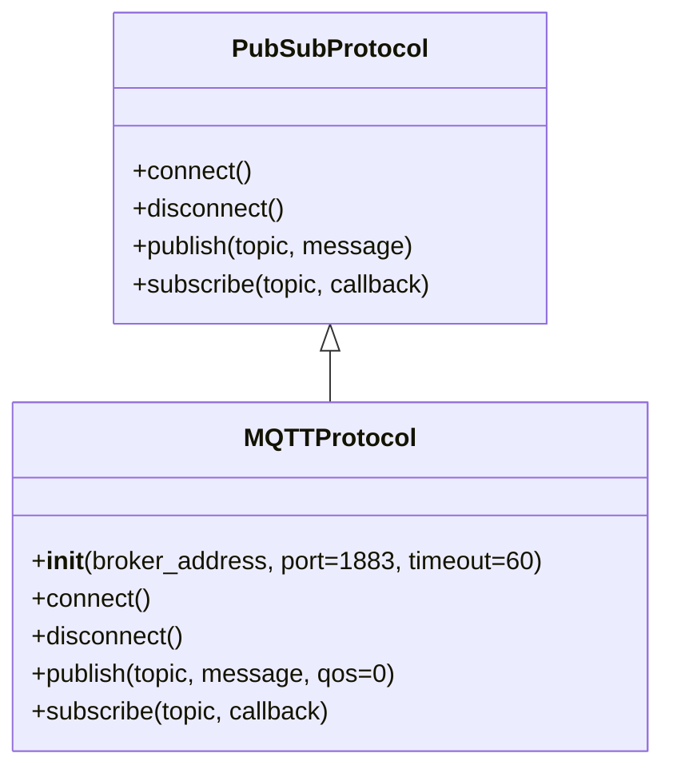
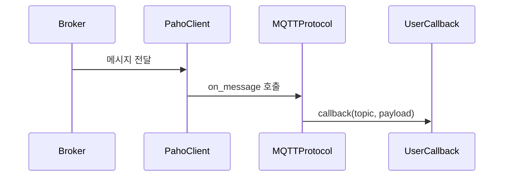

# MQTTProtocol 사용 가이드
MQTTProtocol을 사용하면 MQTT 브로커에 연결해 메시지를 발행하고, 구독한 토픽의 메시지를 콜백으로 처리할 수 있습니다.
이 가이드는 EQ-1 Network 모듈의 MQTTProtocol 클래스 구조, 동작 방식, 사용 예제, 예외 처리 방법을 설명합니다.

## 1. 빠른 시작
```python
from communicator.protocols.mqtt.mqtt_protocol import MQTTProtocol

# 1. 프로토콜 객체 생성
mqtt = MQTTProtocol(
    broker_address="broker.example.com",
    port=1883,
    timeout=60
)

# 2. 브로커 연결
mqtt.connect()

# 3. 토픽 구독
mqtt.subscribe("topic/test", callback=print)

# 4. 메시지 발행
mqtt.publish("topic/test", "hello")

# 5. 연결 해제
mqtt.disconnect()
```

## 2. 주요 개념
### 비동기 동작
- `connect()`를 호출하면 내부적으로 별도의 스레드가 생성되어 MQTT 네트워크 통신을 처리합니다.
- `connect()`는 블로킹되지 않으며, 메인 스레드는 다른 작업을 계속 실행할 수 있습니다.

### 지원 기능
- 브로커 연결 및 해제
- 토픽 구독과 메시지 콜백 처리
- 메시지 발행 (QoS 지원)
- 에러와 이벤트 처리

## 3. 클래스 다이어그램 구조


### 초기화
```python
from communicator.protocols.mqtt.mqtt_protocol import MQTTProtocol

mqtt = MQTTProtocol(
    broker_address="broker.example.com",
    port=1883,
    timeout=60
)
```

### 파라미터 설명
- broker_address: 브로커 주소 (IP 또는 호스트명)
- port: MQTT 포트 (기본 1883)
- timeout: 연결 타임아웃(초 단위)

## 4. 사용 방법
### 연결 및 구독
```python
def on_message(topic, payload):
    print(f"[{topic}] {payload}")

mqtt.connect()
mqtt.subscribe("vision/events", callback=on_message)
```

### 메시지 발행
```python
mqtt.publish("vision/events", "Camera started", qos=1)
```

### 연결 해제
```python
mqtt.disconnect()
```

### 콜백 동작 흐름

### 콜백 시그니처
```python
def callback(topic: str, payload: bytes):
    ...
```

### 예외 처리
#### 주요 예외 클래스:
- ProtocolConnectionError: 브로커 연결 실패
- ProtocolError: 기타 통신 오류

#### 예외 처리 예시:
```python
try:
    mqtt.connect()
except ProtocolConnectionError as e:
    print(f"Connection failed: {e}")
except ProtocolError as e:
    print(f"Protocol error: {e}")
```

## 5. 테스트 방법
- 단위 테스트
    - `pytest` 기반으로 mock 브로커를 활용
    - MQTT 브로커를 실제 실행해 통합 테스트 가능

## 6. 향후 확장 계획
- 보안
    - 인증서 기반 TLS/mTLS 지원
    - 자동 재연결 옵션
    - QoS 설정

## 7. 참고 자료
- [PRD.md](PRD.md)
- [README.md](README.md)