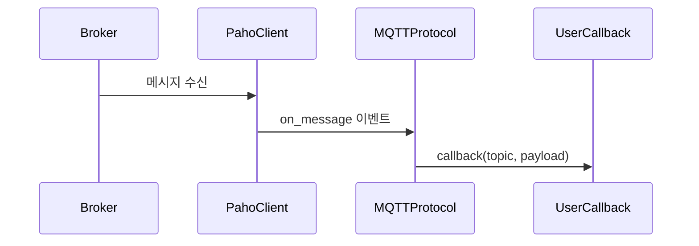

# MQTTProtocol 사용 가이드
MQTTProtocol은 EQ-1 Network의 MQTT Pub/Sub 프로토콜 구현체입니다.
MQTT 브로커와 연결하여 메시지 발행(publish), 토픽 구독(subscribe), 자동 재연결 등의 기본 기능을 제공합니다.

## 1. 빠른 시작
### 기본 사용법
```python
from eq1_network.protocols.mqtt.mqtt_protocol import MQTTProtocol, BrokerConfig, ClientConfig

# 1. 설정 객체 생성
broker_config = BrokerConfig(
    broker_address="broker.example.com",
    port=1883,
    keepalive=60
)
client_config = ClientConfig()

# 2. 프로토콜 객체 생성
mqtt = MQTTProtocol(broker_config, client_config)

# 3. 브로커 연결 (명시적 호출 필요)
mqtt.connect()

# 4. 메시지 콜백 함수 정의
def message_callback(topic: str, payload: bytes):
    print(f"Received: [{topic}] {payload.decode()}")

# 5. 토픽 구독
mqtt.subscribe("topic/test", message_callback)

# 6. 메시지 발행
mqtt.publish("topic/test", "hello")

# 7. 연결 해제
mqtt.disconnect()
```

### 인증 기능 사용법
```python
from eq1_network.protocols.mqtt.mqtt_protocol import MQTTProtocol, BrokerConfig, ClientConfig

# 인증 설정
broker_config = BrokerConfig(
    broker_address="broker.example.com",
    port=1883,                  
    username="mqtt_username",  
    password="mqtt_password",  
    keepalive=60             
)
client_config = ClientConfig()

mqtt = MQTTProtocol(broker_config, client_config)
mqtt.connect()

# Retained Message 발행
mqtt.publish("device/status", "online", qos=1, retain=True)

mqtt.disconnect()
```

### ClientConfig 커스터마이징
```python
from eq1_network.protocols.mqtt.mqtt_protocol import MQTTProtocol, BrokerConfig, ClientConfig

# 기본 설정
broker_config = BrokerConfig(broker_address="localhost")
client_config = ClientConfig()  # 자동 생성된 client_id 사용

# 커스텀 클라이언트 ID 설정
client_config = ClientConfig(
    client_id="Device-A",
    clean_session=True,  # 새로운 세션으로 시작
    userdata={"device_type": "Sensor", "location": "Space-A"}
)

mqtt = MQTTProtocol(broker_config, client_config)
mqtt.connect()
```

## 2. 주요 개념
### 동작 모드
- **non-blocking (기본)**
    - `loop_start()` 기반
    - 연결 후 별도 스레드에서 통신
    - 메인 스레드에서 자유롭게 작업 가능
- **blocking**
    - `loop_forever()` 기반
    - 메인 스레드 블록됨

### 주요 기능
#### 기본 MQTT 기능
- 브로커 연결/해제
- 토픽 구독 및 메시지 콜백 처리
- QoS 0, 1, 2 지원 메시지 발행 (기본값: QoS 0)
- 재연결 시 구독 자동 복구
- 연결 상태 확인 기능 (is_connected 프로퍼티)
- 의도치 않은 연결 실패 시, 자동 재연결

#### 고급 기능
- **메시지 큐잉**: 연결 단절 시 메시지를 큐에 저장하고 재연결 시 자동 발송
- **다중 콜백 지원**: 하나의 토픽에 여러 콜백 등록 가능
- **선택적 구독 해제**: 특정 콜백만 제거하거나 전체 콜백 제거 선택 가능
- **보안 인증**: username/password 인증 지원
- **Retained Messages**: retain 플래그 지원
- **예외 처리**: 연결, 발행, 구독 실패 예외 처리
- **로깅**: 주요 이벤트 로깅 지원

## 3. 클래스 구조
```python
@dataclass
class BrokerConfig:
    broker_address: str
    port: int = 1883
    keepalive: int = 60
    bind_address: Optional[str] = None
    mode: str = "non-blocking"
    username: Optional[str] = None
    password: Optional[str] = None

@dataclass
class ClientConfig:
    client_id: str = field(default_factory=lambda: f"mqtt-{uuid4().hex}")
    clean_session: bool = False
    userdata: Any = field(default_factory=dict)

class MQTTProtocol(PubSubProtocol):
    def __init__(self, broker_config: BrokerConfig, client_config: ClientConfig)
    def connect(self) -> bool
    def disconnect(self)
    def publish(self, topic: str, message: str, qos: int = 0, retain: bool = False) -> bool
    def subscribe(self, topic: str, callback: Callable[[str, bytes], None], qos: int = 0) -> bool
    def unsubscribe(self, topic: str, callback: Callable[[str, bytes], None] = None) -> bool
    @property
    def is_connected(self) -> bool
```

### BrokerConfig 파라미터 설명
#### 기본 연결 설정
- `broker_address` (str): 브로커 주소 (IP 또는 호스트명) - **필수**
- `port` (int): MQTT 포트 (기본 1883)
- `keepalive` (int): Keep-alive 간격(초 단위, 기본 60)
- `bind_address` (Optional[str]): 바인드 주소 (선택 사항)
- `mode` (str): 'blocking' 또는 'non-blocking' (기본 'non-blocking')

#### 보안 설정
- `username` (Optional[str]): MQTT 인증 사용자명
- `password` (Optional[str]): MQTT 인증 비밀번호

### ClientConfig 파라미터 설명
- `client_id` (str): 클라이언트 ID (기본값: 자동 생성)
- `clean_session` (bool): 클린 세션 여부 (기본값: False)
- `userdata` (Any): 사용자 정의 데이터 (기본값: 빈 딕셔너리)

## 4. 고급 동작 방식
### 자동 재연결 및 구독 복구
- 예기치 못한 연결 끊김 감지 → 자동 재연결 시작
- 지수 백오프 재시도 (1초 → 2초 → 4초 → ... 최대 60초)
- 재연결 성공 → 기존 구독 정보 자동 복구
- 발행 실패 시 → False 반환

### 스레드 처리
- non-blocking 모드: `loop_start()` 사용
- blocking 모드: 별도 스레드에서 `loop_forever()` 실행

### 콜백 흐름

```mermaid
sequenceDiagram
    participant Broker
    participant PahoClient
    participant MQTTProtocol
    participant UserCallback

    Broker->>PahoClient: 메시지 수신
    PahoClient->>MQTTProtocol: on_message 이벤트
    MQTTProtocol->>UserCallback: callback(topic, payload)
```

## 5. 사용 방법
### 연결 및 구독
```python
def on_message(topic: str, payload: bytes):
    print(f"[{topic}] {payload.decode()}")

mqtt.connect()
mqtt.subscribe("vision/events", callback=on_message)
```

### 메시지 발행
```python
# 기본 메시지 발행 (QoS 0 기본값)
mqtt.publish("vision/events", "Camera started")

# QoS 레벨 명시적 지정
mqtt.publish("vision/events", "Camera started", qos=1)  # QoS 1
mqtt.publish("vision/events", "Camera started", qos=2)  # QoS 2

# Retained Message 발행
mqtt.publish("device/status", "online", qos=1, retain=True)
```

### 구독 해제
```python
# 토픽의 모든 콜백 제거 (브로커에서도 구독 해제)
mqtt.unsubscribe("vision/events")

# 특정 콜백만 제거 (다른 콜백이 남아있으면 구독 유지)
mqtt.unsubscribe("vision/events", callback=on_message)
```

### 다중 콜백 사용
```python
def callback1(topic: str, payload: bytes):
    print(f"Callback1: [{topic}] {payload.decode()}")

def callback2(topic: str, payload: bytes):
    print(f"Callback2: [{topic}] {payload.decode()}")

# 동일 토픽에 여러 콜백 등록
mqtt.subscribe("sensor/data", callback1)
mqtt.subscribe("sensor/data", callback2)  # 두 콜백 모두 호출됨

# 특정 콜백만 제거
mqtt.unsubscribe("sensor/data", callback1)  # callback2는 여전히 유효
```

### 메시지 큐잉 활용
```python
# 연결 상태에서 메시지 발행
result = mqtt.publish("sensor/data", "normal_message")
print(f"Published: {result}")  # True

# 연결 단절 후 메시지 발행 (큐에 저장)
mqtt.disconnect()
result = mqtt.publish("sensor/data", "queued_message")
print(f"Queued: {result}")  # False (큐에 저장됨)

# 재연결 시 큐에 저장된 메시지 자동 발송
mqtt.connect()  # queued_message가 자동으로 발송됨
```

### 연결 해제
```python
mqtt.disconnect()
```

### 예외 처리
#### 주요 예외 클래스:
- `ProtocolConnectionError`: 브로커 연결 실패
- `ProtocolValidationError`: 메시지 발행/구독 실패
- `ProtocolError`: 일반적인 프로토콜 오류

#### 예외 처리 예시:
```python
from eq1_network.common.exception import (
    ProtocolConnectionError,
    ProtocolValidationError,
    ProtocolError
)

try:
    mqtt.connect()
except ProtocolConnectionError as e:
    print(f"Connection failed: {e}")

try:
    mqtt.subscribe("test/topic", callback)
except ProtocolValidationError as e:
    print(f"Subscribe failed: {e}")
```

## 6. 테스트 방법
### 단위 테스트
```bash
# Mock 기반 단위 테스트
pytest -m "unit" -v
```

### 통합 테스트
```bash
# 실제 브로커와 연동 테스트
pytest -m "integration" -v
```

## 7. 현재 구현 수준
현재 구현은 MQTT v3.1.1 기본 기능을 지원합니다:

### ✅ 완전 지원
- 기본 MQTT 기능 (CONNECT, DISCONNECT, PUBLISH, SUBSCRIBE)
- QoS 0, 1, 2 레벨 완전 지원
- Keep-alive 메커니즘
- Username/Password 인증
- Retained Messages
- **예기치 못한 연결 실패 시 자동 재연결** (지수 백오프)
- 재연결 시 구독 복구
- **연결 실패 시 메시지 큐잉** (데이터 유실 방지)
- **다중 콜백 지원** (토픽당 여러 콜백 등록 가능)
- **선택적 구독 해제** (특정 콜백만 제거 가능)
- **스레드 안전성** (내부 동기화 및 락 처리)
- 예외 처리 및 로깅
- **성능 최적화** (인덱스 매핑 및 데이터 검증 강화)

### 🔄 미구현 기능
- TLS/SSL 보안 연결
- Will Message (Last Will and Testament)
- MQTT v5.0 기능들 (Shared Subscriptions, Message Expiry 등)
- 비동기 콜백 (async/await 패턴)

## 8. 참고 자료
- [README.md](README.md) - 프로젝트 전체 개요
- [PRD.md](prd.md) - 프로젝트 요구사항 문서
